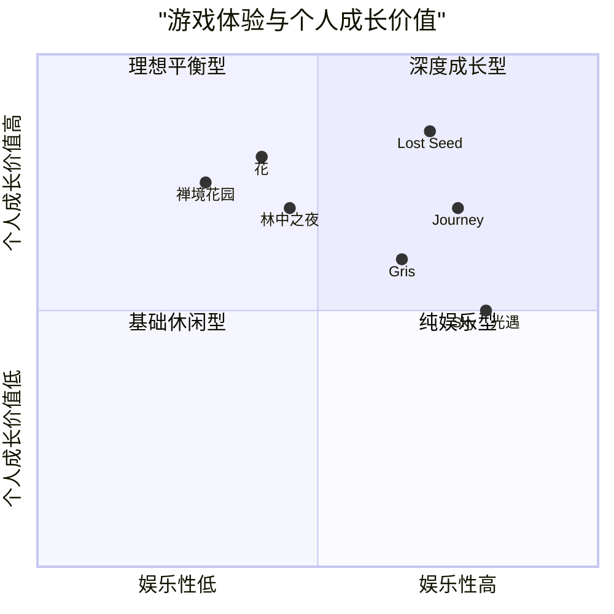

# 产品需求文档 (PRD) - 《Lost Seed: The Key to Bliss》

## 项目信息

- **语言**：简体中文
- **开发语言**：JavaScript (Three.js)
- **项目名称**：lost_seed
- **原始需求**：开发一款基于Three.js的3D游戏，游戏发生在"遗忘森林"中，玩家扮演艾瑞恩，通过记录感恩之情来唤醒希望之树。游戏核心主题是感恩、希望和自我发现。

## 产品定义

### 产品目标

1. **创造沉浸式体验**：利用Three.js的3D渲染能力，打造一个视觉上令人印象深刻的遗忘森林，让玩家能够完全融入游戏世界观。
2. **培养感恩习惯**：通过游戏机制鼓励玩家记录日常生活中的感恩事项，促进积极心态的养成。
3. **提供自我发现旅程**：设计一个将玩家内心成长与游戏进度相结合的叙事体验，使游戏不仅娱乐，还有深层次的意义。

### 用户故事

1. **作为玩家**，我希望能够在一个视觉精美的3D森林中自由探索，以便获得身临其境的游戏体验。
2. **作为玩家**，我想要通过记录感恩日记来看到游戏世界发生积极变化，这样我就能感受到自己行动的直接影响和成就感。
3. **作为玩家**，我希望能够解锁更多的希望之树和游戏区域，从而体验不断扩展的游戏内容和故事发展。
4. **作为玩家**，我希望游戏能够提供一个将我现实生活中的感恩习惯与游戏进展联系起来的方式，帮助我培养积极的生活态度。
5. **作为玩家**，我希望能够收集不同类型的种子，并了解它们代表的不同感恩形式，以便拓展我对感恩概念的理解。

### 竞品分析

| 游戏名称 | 优势 | 劣势 |
|---------|------|------|
| **Journey** | 视觉风格独特；情感共鸣强烈；简单而有深度的gameplay | 线性叙事结构；缺乏个人化定制；游戏时长较短 |
| **花** | 精美的艺术风格；结合音乐与自然体验；冥想式游戏体验 | 交互性较弱；缺乏明确目标结构；重复性较高 |
| **Gris** | 出色的艺术设计；情感化叙事；平台解谜元素 | 缺乏3D探索；游戏机制相对简单；内容量有限 |
| **Sky：光遇** | 社交元素丰富；持续更新内容；高品质视觉效果 | 内购依赖性；对新手不够友好；需联网游玩 |
| **林中之夜** | 深度叙事；独特艺术风格；情感共鸣 | 互动较少；游戏性较弱；3D元素有限 |
| **禅境花园** | 平静的游戏体验；培养正念习惯；简单易上手 | 缺乏故事性；游戏深度不足；视觉表现有限 |
| **《Lost Seed》(我们的产品)** | 3D沉浸式森林环境；感恩机制与现实生活结合；情感化叙事与自我成长 | 开发复杂度高；需平衡教育价值与娱乐性；依赖用户持续参与 |

### 竞品象限图

## 技术规格

### 需求分析

《Lost Seed: The Key to Bliss》是一款基于Web的3D冒险游戏，玩家将在其中探索遗忘森林，通过记录感恩之情来唤醒希望之树。该游戏需要强大的图形渲染能力以创建沉浸式的森林环境，同时需要实现一个直观的用户界面来支持感恩日记系统和游戏进度追踪。

核心技术需求：
- Three.js用于3D环境渲染和交互
- 响应式设计，确保在不同设备上的良好体验
- 数据持久化，保存玩家进度和感恩日记
- 动画效果，用于树木生长、种子发光等视觉表现
- 粒子系统，用于森林氛围和特效

### 需求池

#### P0 (必须实现)

1. **核心游戏环境**
   - 开发一个可探索的3D遗忘森林环境
   - 实现基本的玩家角色控制系统（移动、旋转、交互）
   - 创建至少5个初始的希望之树模型，具有不同的视觉特征

2. **感恩日记系统**
   - 开发交互式日记界面，允许玩家输入感恩内容
   - 实现日记内容与种子生成的关联机制
   - 设计种子收集和展示系统

3. **希望之树互动**
   - 实现玩家与希望之树的互动机制
   - 开发树木从枯萎状态到焕发生机的视觉变化效果
   - 创建种子与树木互动的视觉效果

4. **基础游戏进度系统**
   - 实现玩家进度的保存和加载
   - 开发解锁机制，记录已激活的树木
   - 创建简单的成就系统，跟踪玩家完成的里程碑

#### P1 (应该实现)

1. **幸福之门系统**
   - 设计并实现幸福之门的视觉效果和开启动画
   - 创建钥匙收集机制和门的解锁条件
   - 开发门后新区域的加载和转场效果

2. **增强的森林环境**
   - 添加动态天气和昼夜循环系统
   - 实现风吹动树叶和草地的动画效果
   - 增加环境音效和空间音频

3. **角色定制化**
   - 允许玩家自定义艾瑞恩的外观
   - 实现可解锁的服装和装饰品

4. **引导系统**
   - 开发非侵入式的游戏教程
   - 创建希望之神的NPC角色，提供故事和任务引导
   - 实现任务提示和目标指引系统

#### P2 (可以实现)

1. **扩展世界区域**
   - 开发遗忘之地的其他区域（失落之城、冰霜荒原、希望之岛）
   - 为每个区域创建独特的视觉风格和挑战

2. **社区功能**
   - 实现玩家之间分享感恩故事的功能
   - 开发公共森林空间，显示社区贡献

3. **季节性活动**
   - 设计与现实世界节日相关的特殊活动
   - 创建限时挑战和奖励系统

4. **高级视觉效果**
   - 实现先进的光照和阴影系统
   - 开发复杂的粒子效果用于魔法和自然现象
   - 添加后处理效果，提升整体视觉质量

### UI设计草案

#### 主界面

- 中央显示游戏标题《Lost Seed: The Key to Bliss》
- 开始游戏按钮（新游戏/继续）
- 设置选项（音量、图形质量、语言等）
- 关于/制作人员按钮

#### 游戏内UI

- **左上角**：玩家状态（收集的种子数量、解锁的树木数量）
- **右上角**：菜单按钮（设置、地图、任务日志）
- **底部中央**：交互提示（当玩家接近可交互物体时显示）
- **可切换式日记界面**：
  - 打开时覆盖游戏画面的右侧2/3
  - 包含文本输入区域和表情选择器
  - 显示之前的感恩条目和相关获得的种子
  - 提交和关闭按钮

#### 种子收集界面

- 网格布局显示已收集的种子
- 每个种子显示关联的感恩类型
- 种子详情查看选项
- 筛选和排序功能

#### 幸福之门界面

- 显示门的大型图像，突出钥匙插槽
- 可拖放收集的种子（作为钥匙）到对应槽位
- 进度指示器显示还需多少钥匙才能开启
- 完成后的过场动画提示

### 开放问题

1. **游戏难度平衡**
   - 如何设计感恩日记系统，使其既有教育意义又不失游戏乐趣？
   - 收集种子和解锁新区域的节奏应该如何控制？

2. **技术实现挑战**
   - Three.js在大规模森林环境中的性能优化策略？
   - 如何在不同设备上保持一致的视觉质量和用户体验？

3. **用户参与度**
   - 如何鼓励玩家持续记录感恩日记？
   - 是否应该设计日常任务或提醒系统？

4. **隐私考虑**
   - 玩家的感恩日记内容应如何存储和保护？
   - 是否应该提供内容分享功能，如何实现？

5. **扩展可能性**
   - 游戏是否应计划定期内容更新？
   - 是否考虑多平台发布（移动应用、桌面版）？

## 游戏机制详解

### 感恩日记系统

感恩日记是游戏的核心机制，它连接了玩家的情感表达与游戏世界的变化。

**工作原理**：
1. 玩家可以在游戏中任意时刻打开日记界面
2. 界面提供一个主题提示（如"今天，我感谢..."）
3. 玩家输入感恩内容（至少30个字）
4. 系统分析内容，根据关键词和情感色彩确定种子类型
5. 提交后，一段动画显示文字发光并形成种子

**种子类型**：
- **希望种子**：表达对未来的积极期待
- **爱之种子**：关于人际关系和情感连接
- **成长种子**：关于个人成长和克服困难
- **和平种子**：关于内心平静和满足
- **欣赏种子**：关于对自然和艺术的感谢

每种种子都有独特的外观和发光效果，使用Three.js的粒子系统和自定义着色器实现。

### 希望之树互动

希望之树是玩家情感表达的物理化身，随着玩家的感恩而逐渐焕发生机。

**树木状态**：
1. **沉睡**：初始状态，树木枯萎，被迷雾笼罩
2. **觉醒**：收集到第一颗相应类型的种子后，树木开始微微发光
3. **生长**：随着更多种子的收集，树木逐渐展开枝叶，迷雾消散
4. **繁盛**：完全解锁后，树木焕发生机，产生光芒和粒子效果

**技术实现**：
- 使用Three.js的InstancedMesh渲染多棵树木，提高性能
- 应用骨骼动画系统实现树木生长过程
- 结合顶点着色器创建迷雾消散和发光效果
- 使用粒子系统模拟光点和花朵

### 幸福之门系统

幸福之门是通往游戏新区域的入口，解锁它需要收集特定数量和类型的种子。

**解锁机制**：
1. 每扇幸福之门需要5-7个特定类型的种子作为钥匙
2. 玩家需要将种子放置在门周围的特定位置
3. 放置正确的种子后，门上的藤蔓和迷雾开始消散
4. 所有种子就位后，触发开门动画，揭示新区域

**视觉效果**：
- 使用Three.js的后处理效果创建门周围的光芒和扭曲
- 应用顶点动画模拟迷雾和藤蔓的消散
- 实现空间变换效果，展示门后新世界的一瞥

### 探索与进度系统

探索是推动游戏前进的关键元素，玩家需要在森林中寻找新的希望之树和收集资源。

**探索要素**：
1. **地标导航**：使用独特的自然地标帮助玩家导航
2. **迷雾系统**：初始时大部分地区被迷雾覆盖，随探索和树木觉醒而消散
3. **发现奖励**：隐藏的感恩故事碎片，提供额外的叙事内容

**进度追踪**：
- 解锁的树木数量/总数
- 收集的种子类型和数量
- 开启的幸福之门数量
- 发现的隐藏故事

## 视觉风格与技术实现

### 遗忘森林的视觉设计

遗忘森林需要传达一种神秘而又充满希望的氛围，表现出从遗忘到重生的转变。

**艺术方向**：
- 半写实风格，融合梦幻和神秘元素
- 色彩方案：初始区域使用冷色调和灰色，随着进度推进，逐渐转向温暖的金色和绿色
- 灯光：柔和的定向光，穿过树叶的光束，创造体积光效果

**技术实现**：
- 使用Three.js的实例化渲染技术处理大量树木和植被
- 实现LOD（细节层次）系统，根据距离调整模型复杂度
- 应用自定义着色器创建树叶摇曳和光线散射效果
- 结合后处理效果增强整体视觉印象（光晕、景深、色彩分级）

### 特效系统

视觉特效对于强化游戏的情感体验和反馈至关重要。

**关键特效**：
1. **种子生成**：文字化为光点，凝聚成种子的过程
2. **树木觉醒**：树木从枯萎到生机勃勃的变化过程
3. **迷雾消散**：随着玩家进度推进，迷雾逐渐消退的效果
4. **幸福之门开启**：门释放光芒，揭示新世界的动画

**技术细节**：
- 使用GPU加速的粒子系统（THREE.Points）实现光点和魔法效果
- 应用顶点和片段着色器创建自定义视觉效果
- 结合骨骼动画和变形目标实现树木生长动画
- 使用体积雾和自定义深度材质实现迷雾效果

## 角色设计

### 艾瑞恩（玩家角色）

艾瑞恩是玩家在游戏中的化身，他的设计需要既有个性又能让玩家产生代入感。

**视觉设计**：
- 中性、友好的外观，适合各种玩家群体
- 简洁但独特的服装，带有自然元素和神秘符号
- 随着游戏进程，服装和外观可以反映收集的种子类型

**技术实现**：
- 使用骨骼动画系统实现流畅的角色移动
- 应用换肤系统允许外观定制
- 实现与环境的物理交互（如穿过草丛，踩踏地面等）

### 希望之神

希望之神是游戏中的指导者，提供故事背景和任务引导。

**设计理念**：
- 以光和自然元素为主题的半透明形象
- 只在关键剧情点出现，保持神秘感
- 声音温和而有回响，给人安心感

**互动方式**：
- 出现在特定地点，提供故事线索
- 在玩家完成重要里程碑时给予奖励
- 通过对话引导玩家理解感恩的不同形式

## 故事发展

### 主线剧情

游戏的叙事围绕艾瑞恩在遗忘森林中寻找希望之种，唤醒遗忘之树的旅程展开。

**第一章：觉醒**
- 艾瑞恩被希望之神召唤到遗忘森林
- 发现第一棵希望之树并学习感恩日记系统
- 解锁基础种子类型，了解森林被遗忘的历史

**第二章：探索**
- 进一步探索森林，寻找更多希望之树
- 遇到森林中的其他角色，了解他们的故事
- 收集更多种子，逐步驱散迷雾

**第三章：转变**
- 开启第一扇幸福之门，进入新区域
- 发现更复杂的希望之树类型
- 了解遗忘之地的更深层历史

**第四章：救赎**
- 面对森林深处的"遗忘之核"，代表内心的怀疑
- 使用所有收集的种子和唤醒的树木之力
- 最终转变遗忘森林，恢复其本来面貌

### 情感发展曲线

游戏的情感体验设计遵循起伏的节奏，创造引人入胜的体验：

1. **好奇与发现**：初始探索阶段，玩家体验新奇和好奇
2. **挫折与坚持**：中期任务难度增加，需要更多努力才能解锁进展
3. **成就与满足**：随着更多树木被唤醒，玩家体验成就感
4. **挑战与怀疑**：面对最终区域时的困难和挑战
5. **胜利与领悟**：完成主线任务后的满足和对感恩重要性的深刻理解

## 实现路线图

### 第一阶段：核心功能开发（3个月）

1. **月1**：
   - 构建基本的Three.js环境和渲染管道
   - 实现玩家角色控制系统
   - 开发初始森林环境的基础版本

2. **月2**：
   - 实现感恩日记系统和基础UI
   - 开发种子生成和收集机制
   - 创建第一版树木模型和生长动画

3. **月3**：
   - 完善森林环境，添加细节和氛围
   - 实现简单的进度保存系统
   - 开发基础特效系统

### 第二阶段：内容扩展（3个月）

4. **月4**：
   - 开发幸福之门系统和相关特效
   - 扩展希望之树类型和互动方式
   - 增加更多树木和植被种类

5. **月5**：
   - 实现昼夜循环和天气系统
   - 开发NPC角色和对话系统
   - 添加环境音效和音乐

6. **月6**：
   - 扩展游戏区域，添加第二和第三区域
   - 完善特效系统，提升视觉质量
   - 优化游戏性能，提高兼容性

### 第三阶段：完善和发布（2个月）

7. **月7**：
   - 进行全面测试和bug修复
   - 优化用户体验和游戏平衡性
   - 添加成就系统和收藏品

8. **月8**：
   - 最终视觉和表现优化
   - 准备发布资料和推广内容
   - 正式发布游戏

## 总结

《Lost Seed: The Key to Bliss》是一款独特的3D探索游戏，将感恩的力量与互动故事相结合，通过Three.js的强大渲染能力呈现一个视觉上令人惊叹的遗忘森林世界。游戏的核心机制——感恩日记系统，不仅是游戏进程的驱动力，还能潜移默化地影响玩家在现实生活中培养感恩的习惯。

通过精心设计的希望之树、种子收集和幸福之门系统，玩家将体验一段关于自我发现和个人成长的旅程。游戏的艺术风格和技术实现共同营造出一个既神秘又温暖的世界，让玩家在探索的过程中感受到希望和感恩的力量。

开发团队需要重点关注游戏的性能优化、情感连接和教育价值的平衡，确保游戏既有趣味性又能传达其核心理念。随着开发的推进，我们期待《Lost Seed: The Key to Bliss》能够成为一款既有深度又有广度的作品，为玩家带来独特而有意义的游戏体验。